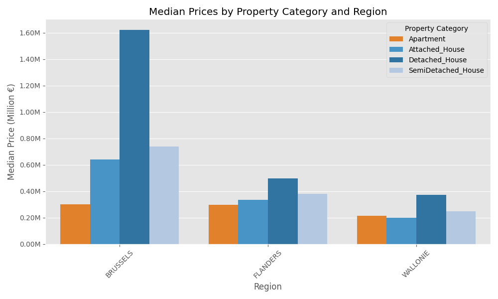
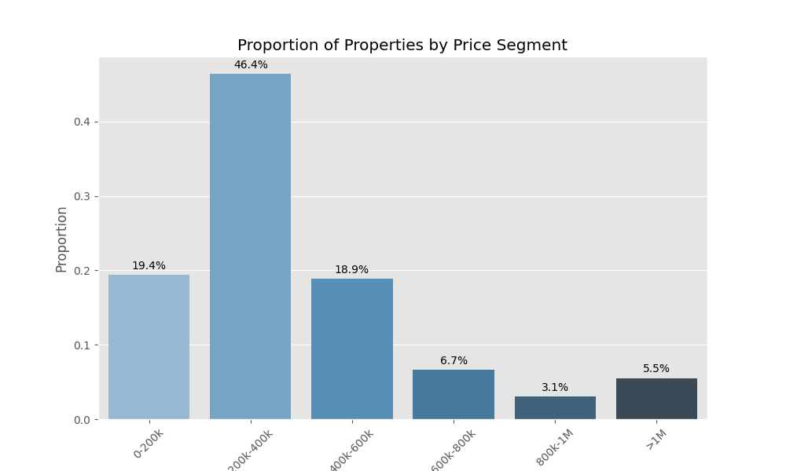

# Immo Charlie Phase 02: Data Analysis & Visualisation

## 📖 Description

This is phase 2 of a larger project where I develop an ML pipeline for property price prediction.
Have a look at phase 1 (data collection) [here](https://github.com/emsuru/charlie-01-data-collection) and phase 3 (ML model development) [here](https://github.com/emsuru/charlie-03-ML-model-development). Phase 4 (deployment) is not yet started.

The deliverables for this phase:
- EDA notebooks
- mock customer presentation

The most challenging part for me was accepting just **how much** of EDA is iterative. It was especially hard to accept that I may discover something towards the end of the exploration, or at a very advanced phase, which will require me to redo everything once more.

## Visuals

## 📂 Project background & timeline

This project was done over the course of one week in February 2024.

Its main goals were to practice:

- exploratory data analysis (EDA)
- data cleaning & preparation
- data visualisation
- data storytelling & presentation

## Project extension

If I have time to return to this, I'd like to:

- use a better, clearer structure, where I split the investigation into structure, quality & content and for each section look at categorical variables and numerical variables separately and in a clear order (e.g. ordinal then nominal, discrete then continuous)
- have a different version of the exploration where I try fancier libraries and dataviz tools (PyGWalker, Bokeh, Streamlit, Dash)

## ⚠️ Warning

All my code is currently heavily:

- docstringed
- commented

.. and sometimes typed.

This is to help me learn and to make my sessions with our training coach more efficient.

## Thank you for visiting my project page!

Connect with me on [LinkedIn](https://www.linkedin.com/in/mirunasuru/) 🤍
