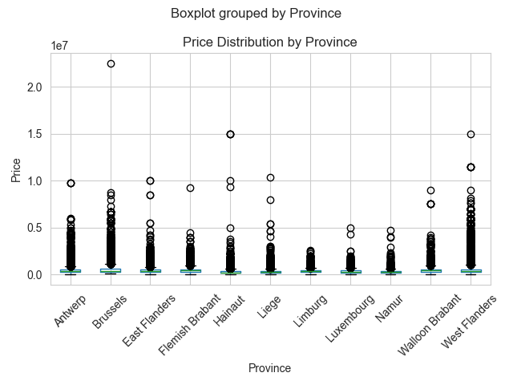
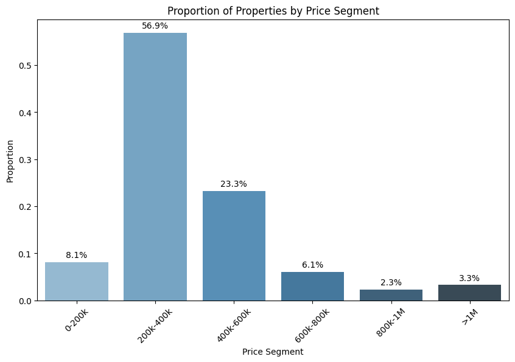
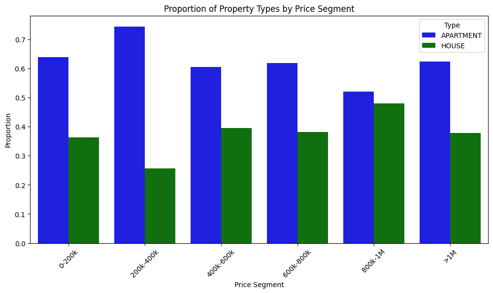
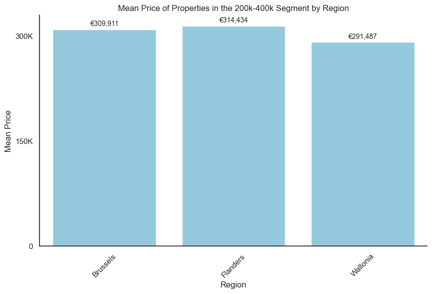

# Immo Charlie Phase 02: Data Analysis & Visualisation

## 📖 Description

This is the data analysis phase of a larger project to develop a machine learning model for price prediction. Have a look at [phase 1 (data collection)](https://github.com/emsuru/charlie-01-data-collection) and [phase 3 (ML model development)](https://github.com/emsuru/charlie-03-ML-model-development). Phase 4 (deployment) is not yet started.

Here in phase 2 I perform data exploration, cleanup and analysis starting from the raw dat set collected in phase #1 of the project.

The result is a Jupyter Notebook containing my process. Some of the dataviz graphs generated are exported and included in a
mock customer presentation.

## Visuals

## 📂 Project background & timeline

This project was done over the course of 3 days in February 2024.
It is my personal version of a team project I was involved in during the AI Bootcamp in Ghent, Belgium, 2024.

Its main goals were to practice:

- exploratory data analysis
- data cleaning
- data visualisation
- data presentation

## ⚠️ Warning

All my code is currently heavily:

- docstringed
- commented

.. and sometimes typed.

This is to help me learn and to make my sessions with our training coach more efficient.

## Thank you for visiting my project page!

Connect with me on [LinkedIn](https://www.linkedin.com/in/mirunasuru/) 🤍
